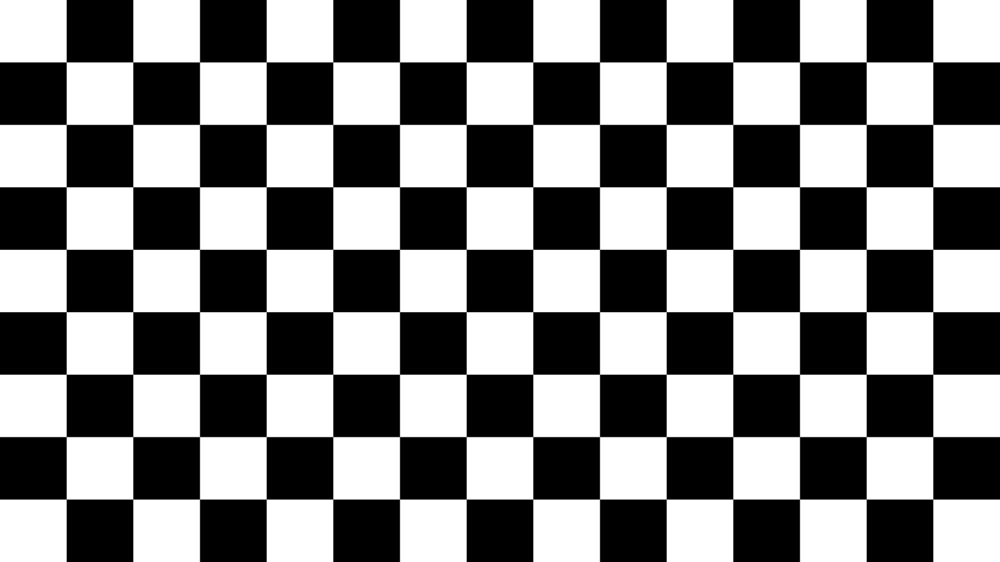

# Wallpapers

Desktop Wallpapers I have created for one-off reasons

----

## Checkerboard

A checkerboard designed for testing placement of a 1080p projector.

### Design Requirements

- 1920x 1080y
- All 4 corners should have white squares
  - odd number of columns and rows
- Each "square" should be nearly square

#### Implementation Details

Because I think in Python, I fired up a bpython interpreter and generated the options. This is easily done with nested list comprehensions.

```python
# bpython version 0.24 on top of Python 3.12.3

>>> from pprint import pprint
>>> pprint([[['{:02d}'.format(n),'{:.2f}'.format(v/n)] for v in [1920,1080]] for n in [7,9,11,13,15,17]])
[[['07', '274.29'], ['07', '154.29']],
 [['09', '213.33'], ['09', '120.00']],
 [['11', '174.55'], ['11', '98.18']],
 [['13', '147.69'], ['13', '83.08']],
 [['15', '128.00'], ['15', '72.00']],
 [['17', '112.94'], ['17', '63.53']]]
```

Considering these numbers, I chose to use 15 columns and 9 rows of 128x120 squares.

| Inkscape SVG | PNG |
|--------------|-----|
|  |  |

----
